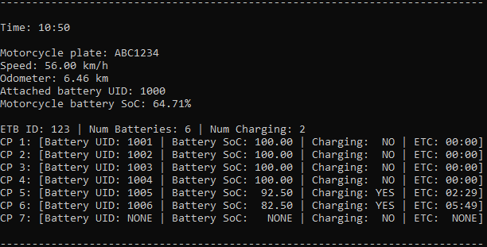

# desafio-origem

Desafio do estágio de desenvolvimento de firmware na Origem.  

## Instruções de compilação

Utilizei o CMake na versão 3.22.4 para Windows 10 64-bits.  
Como gerador, utilizei o Visual Studio 17 2022, versão 17.2.2.  
O compilador é o g++ na versão 9.2.0.   
Esta versão do compilador suporta totalmente C++17 e algumas funcionalidades de C++20.

Para compilação e geração do executável, basta navegar até o diretório build do projeto e executar o seguinte comando:

`cmake --build .`

Depois disso, o executável estará no diretório `build/Debug`, com o nome `desafio-origem.exe`, e pode ser executado no próprio console para visualização dos resultados.

## Funcionalidades

Primeiro, irei comentar sobre as informações que são impressas no console durante a simulação a cada `PRINT_INTERVAL` segundos, que pode ser alterado no código fonte.
Irei separar as funcionalidades entre as quatro classes que representam os objetos no mundo real que será simulado. Estes são: moto, bateria, CP (ponto de carga) e ETB (estação de troca de bateria).

### Prints no console

As informações mostradas no console serão listadas a seguir:

1. Tempo de simulação (MM:SS)
2. Placa do motocicleta
3. Velocidade da motocicleta em km/h
4. Odômetro da motocicleta durante a simulação
5. UID da bateria associada à motocicleta
6. Carga da bateria associada à motocicleta
7. ID da ETB monitorada na simulação
8. Número de baterias armazenadas na ETB
9. Número de baterias sendo carregadas na ETB
10. Para cada CP da ETB, tem-se:
    1. UID da bateria associada ao CP
    2. Carga da bateria associada ao CP
    3. Indicação se o CP está carregando ou não a sua bateria
    4. Estimated time until charge: tempo estimado até o fim de carregamento da bateria

### Moto

- turnOn() e turnOff(): ligar e desligar a moto. Coloquei a limitação de só poder ligar se houver bateria com alguma carga, e só poder desligar se a moto estiver parada (velocidade = 0), a menos que bateria (sem carga) seja a causa do desligamento.

- attachBattery() e detachBattery(): conectar ou desconectar a bateria da motocicleta. Para conectar, é necessário que não haja outra bateria na bicicleta e que a bateria não esteja conectada a outro Host. Para desconectar, a moto deve estar desligada.

- throttle(), brake() e releaseBrake(): acelerar, freiar ou soltar o freio da motocicleta. Para acelerar, é necessário que a moto esteja ligada, e isso só causará de fato um efeito na velocidade se houver carga na bateria. Quando o freio é apertado, automaticamente a aceleração é desligada.

- outros métodos são getters ou utilizados internamente na simulação.

### ETB

- attachBatteryToCp() e detachBatteryFromCp(): conecta ou desconecta a bateria de um ponto de carga da ETB. Para conectar é necessário que o CP esteja livre e que a bateria não tenha Host ainda.

- startChargeCp() e stopChargeCp(): inicia ou interrompe o carregamento de algum ponto de carga da ETB.

- getNumBatteries(): retorna o número de baterias armazenadas na ETB.

- getNumCharging(): retorna o número de pontos de carga carregando baterias.

- timeLeftCharging(): retorna o tempo em segundos que falta para terminar o carregamento da bateria de algum PC.

- automaticChargeControl(): essa função liga e desliga automaticamente os pontos de carga a depender da carga das baterias.

- outros métodos são getters ou utilizados internamente na simulação.

### Bateria

- attachHost() e detachHost(): conecta ou desconecta a bateria de algum Host, que pode ser uma Moto ou ETB.

- updateSoc(): atualiza a carga da bateria a depender do Host e das condições da simulação.

- outros métodos são getters ou utilizados internamente na simulação.

### CP

- attachBattery() e detachBattery(): conecta ou desconecta a bateria do CP.

- startCharge() e stopCharge(): liga ou desliga o carregamento no ponto de carga.
